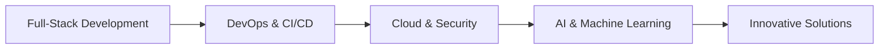

<div align="center">

# 👋 Hi, I'm Jallouli Yassine

<a href="https://git.io/typing-svg">
  
</a>

### 🚀 Ingénieur Informatique | Web • DevOps • Sécurité • IA

<p align="center">
  <a href="https://www.linkedin.com/in/jallouliyassine/" target="_blank">
    
  </a>
  <a href="mailto:yassine.jallouli@esprit.tn">
    
  </a>
  <a href="https://my-portfolio-front-rouge.vercel.app" target="_blank">
    
  </a>
  <a href="https://github.com/Jallouli-Yassine" target="_blank">
    
  </a>
</p>

---

### 💼 About Me

<div align="center">

**👨‍💻 Ingénieur Informatique & Full-Stack Developer**

📍 Tunisia 🇹🇳 | 🎓 Computer Engineering Graduate

</div>

---

<div align="center">

#### 🚀 My Tech Journey

```
┌─────────────────────────────────────────────────────────────┐
│  💻 Web Development    🔧 DevOps & CI/CD    🔒 Security     │
│                  🤖 AI & Machine Learning                    │
└─────────────────────────────────────────────────────────────┘
```

</div>

<table align="center">
<tr>
<td width="33%" align="center">

### 🎯 Focus
Building scalable  
full-stack applications  
with modern frameworks

</td>
<td width="33%" align="center">

### 📚 Learning
Artificial Intelligence  
Machine Learning  
Deep Learning

</td>
<td width="33%" align="center">

### 💪 Expertise
Angular • Spring Boot  
Docker • Azure  
Jenkins • CI/CD

</td>
</tr>
</table>

<div align="center">

💡 *Turning ideas into innovative solutions, one commit at a time*

</div>

</div>

---

## 🛠️ Tech Stack

### 💻 Frontend Development
<p align="left">
  
</p>

### ⚙️ Backend Development
<p align="left">
  
</p>

### 🗄️ Databases
<p align="left">
  
</p>

### ☁️ DevOps & Cloud
<p align="left">
  
</p>

### 🧰 Tools & IDEs
<p align="left">
  
</p>

### 📚 Programming Languages
<p align="left">
  
</p>

---

## 📊 GitHub Statistics

<div align="center">
  
  
</div>

<div align="center">
  
</div>

<div align="center">
  
</div>

---

## 🏆 Featured Projects

<div align="center">

[](https://github.com/Jallouli-Yassine/myPortfolioFront)
[](https://github.com/Jallouli-Yassine/SIUESPORTS.pidev.3A37)

</div>

### 🚀 Notable Work

- **ArenaLink** - Full-stack football match management platform (Spring Boot, Angular, Azure)
- **Project Management App** - Agile project management tool similar to JIRA (NestJS, React)
- **DevOps CI/CD Pipeline** - Complete automation with Jenkins, Docker, SonarQube, Grafana
- **E-Sports Platform** - Comprehensive platform with Symfony, Codename One mobile app
- **E-Commerce Platform** - Online store with Angular & Spring Boot

<div align="center">
  <a href="https://github.com/Jallouli-Yassine?tab=repositories">
    
  </a>
</div>

---

## 🎯 Current Focus (2026)



- 🔹 **Deep Diving:** Advanced AI/ML algorithms and neural networks
- 🔹 **Automating:** Complex deployment workflows and infrastructure as code
- 🔹 **Optimizing:** Application performance and scalability patterns
- 🔹 **Strengthening:** Security implementations and vulnerability testing
- 🔹 **Contributing:** Open-source projects and tech communities

---

## 💡 What I Bring

<div align="center">

| 🎯 Expertise | 📈 Level | 🔥 Projects |
|-------------|----------|-------------|
| Full-Stack Web Development | ████████░ 85% | 11+ |
| DevOps & CI/CD | ███████░░ 75% | 5+ |
| Cloud & Deployment | ██████░░░ 70% | 4+ |
| Security & Best Practices | ██████░░░ 65% | 6+ |
| AI/ML (Learning) | ███░░░░░░ 30% | 1+ |

</div>

---

## 📫 Let's Connect!

<div align="center">

**Open to freelance opportunities, collaborations, and exciting projects!**

<a href="mailto:yassine.jallouli@esprit.tn">
  
</a>
<a href="https://www.linkedin.com/in/jallouliyassine/">
  
</a>
<a href="https://my-portfolio-front-rouge.vercel.app">
  
</a>

### 📊 Profile Views


---

<p align="center">
  
</p>

**⭐ From [Jallouli-Yassine](https://github.com/Jallouli-Yassine) with 💙**

</div>
